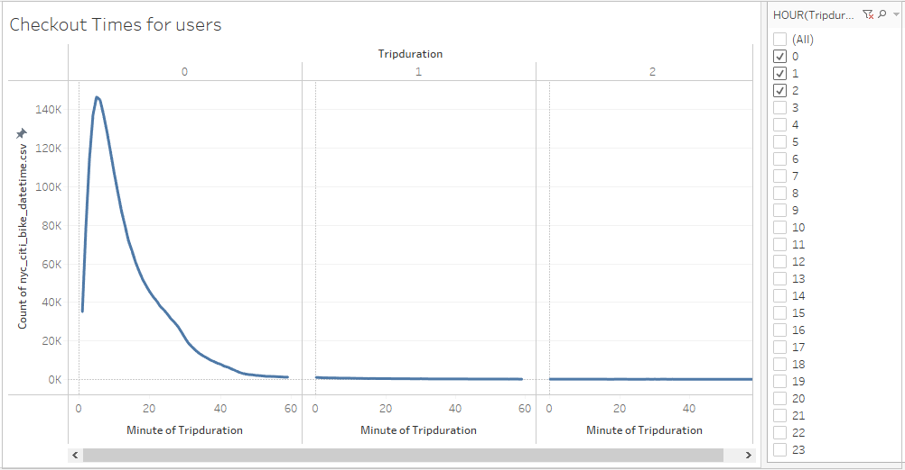
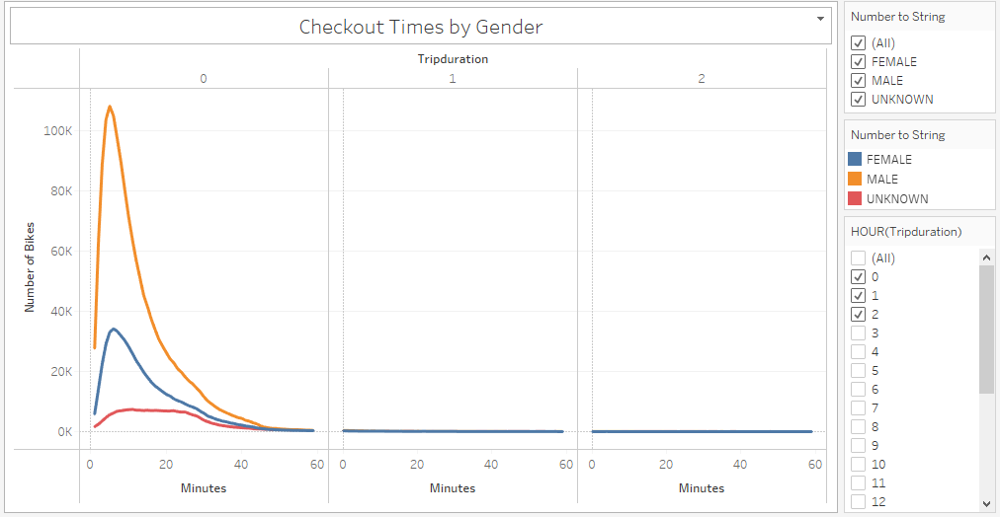
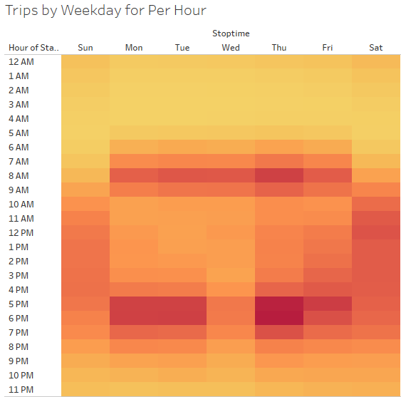
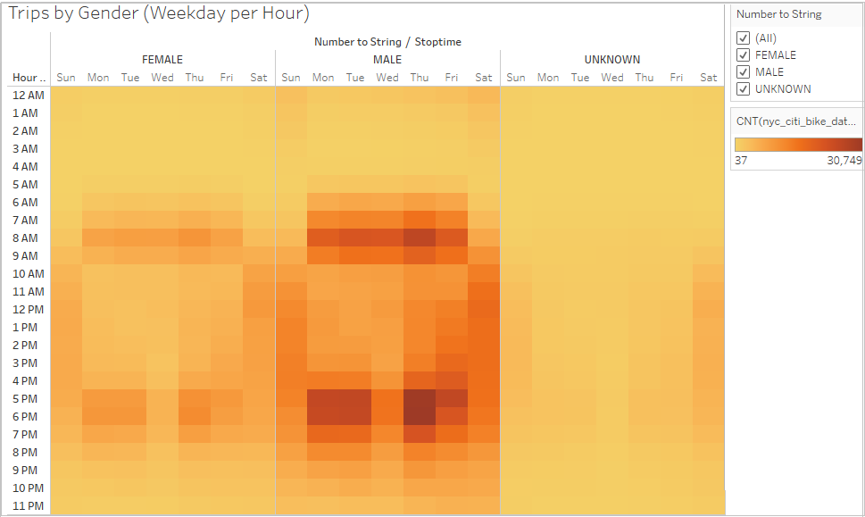
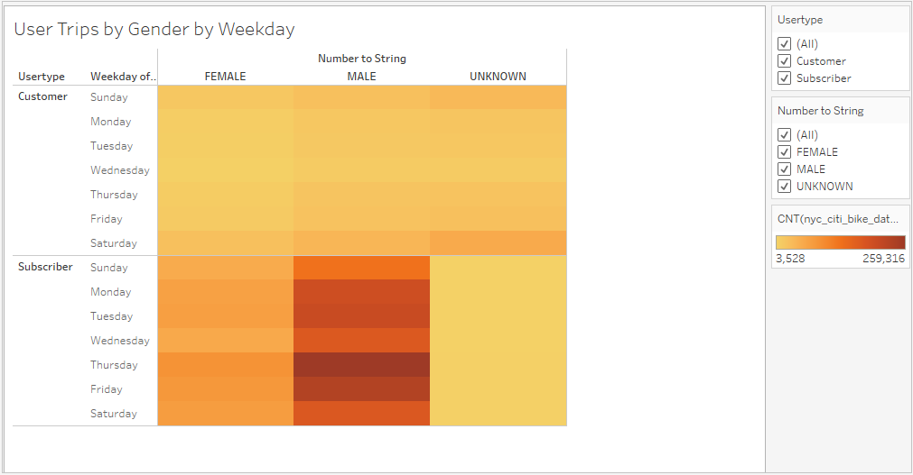

# NYC CitiBike

## Project Overview
### Purpose

For this project we are creating data visualization with Tableau for bike sharing program in New York City. The idea is to analyze the data, observe the mechanics of the business and figure out how the bike share business actually works in NYC. This is the first step of expanding the idea to other cities. With te help of strong and clear story and good example of data we can create a proposal on how the business could work in other cities as well.

**The Tableau story of the NYC CitiBike can be found in the following link:** [NYC CitiBike Story](https://public.tableau.com/)

### Background 

- Tableau is a data visualization tool which provides pictorial and graphical representations of data. 
- It allows to create stories that are visually appealing and understandable to any non-technical user.
- It provides the tool which creates powerful analytic dashboards and tells clear story which can be easily shared to others.
- It is simple, required little coding or write queries as 'Calculated Field' , to ensure your data is showing correct analytics as per the requirements. 

## Requirements

- Change  Trip Duration to a Datetime Format
  - Pandas to convert integer to a datetime datatype.
  
-	Create Visualizations for the Trip Analysis
    - Tableau to create visualizations, dashboard and story.

## Resources 
-	Data Source:
    - [CitiBike Trip History Data from August 2019 in NYC](https://www.citibikenyc.com/system-data)
    
-	Software:
    - Tableau Public 2021.4
   
-	Languages & Environment:
    - Pandas, Python 3.7

## Results

### Basic Information

This is the first page of the story which is dashboard and it contains basic information about the data set.
It gives details of the dataset to understand what kind of data we will be dealing with in the further analysis. 
  

The page contains the following information:
-	Type of business(CitiBike), location with perticular time frame of the data (New York City, August 2019).
-	Number of the total rides: 2,344,224.
-	Customer type: subscribers and customers.
-	Peak hours, divided by gender which shows the user behaviour.
#
### 1. Checkout Times for Users

 
- This visualization shows the length of time of every bike ride during the month of August in 2019. 
- It shows that riders typically like to ride bike between 2 and 15 minutes.

#
### 2. Check Out Time by Gender

- The graph shows number of checkout bikes and trip duration.
- Three different colors represent the classification of gender. Yellow represents male, blue represents female and red represents the unknown gender. 
- This visualization shows the breakdown of riders by gender and duration of times showing that most of the users are men.
 
#
### 3. Trips by Weekday per Hour

- The graph shows number of trips per hour and per weekday. 
- The graph has hours as rows and weekdays as columns.
- The color indicates the number of trips.
  - Darker shade color indicates more trips,
  - Lighter shade color indicates less trips.
-  Form the graph we can see that the busiest times are in the morning hours on weekdays from 6 am and 9 am and evening hours on weekdays between 5 pm and 7 pm. 
-  On weekends (Saturday and Sunday) the busiest times are in the middle of the day between 10 am and 6 pm.

#
### 4. Trips by Gender (Weekday per Hour)

- The graph shows number of trips per hour and per weekday. 
- The graph has hours on the rows and weekdays on the columns.
-  The color indicates the number of the trips.
   - Darker shade color indicates more trips,
   - Lighter shade color indicates less trips.
-  Additionally, the graph is divided by gender (male, female and unknown). 
-  From the graph we can see that distribution of the checkout times for all genders is similar.
  - The busiest times are
     - In the morning hours on weekdays from 6 am and 9 am
     - In the evening hours on weekdays between 5 pm and 7 pm. 
     - On weekends (Saturday and Sunday) the busiest times are in the middle of the day between 10 am and 6 pm. 
-  However, males have significant higher number of trips than female or unknown gender. 

#
### 5. User Trips by Gender by Weekday

- The graph shows number of trips by weekday, by user type (subscribers and customers) and by gender. 
- The graph has weekdays and user type as rows and gender as columns.
- Amongst subscribers, male has the highest number of the trips especially on Thursdays and Fridays, followed by trips on Monday and Tuesdays.
- Female has similar distribution of trips, with significant lower number of trips than male.
- Unknown gender has uniform distribution of the trips throughout the week. 
- Looking at the customers’ data we can see significant less trips throughout all genders with slight increase amongst unknown gender on Saturdays and Sundays.

#
### 6. Top Starting Locations & Top Ending Locations

    

From those two graphs we can see the most popular starting and ending locations. Orange color represent subscribers, while blue represent customers. Larger bubbles represent locations with the highest number of trips, and smaller bubbles represent lowest number of trips. From the graph we can see which stations are more popular amongst subscribers vs. customers and what areas are more popular than others. Downtown area is much more popular than surrounding areas, yet it is as important for surrounding areas to have bike services, in order to ensure good customer experience.

## Summary

The story of the NYC CitiBike starts off with the basic information about the users and the trips. From the first page we can learn a lot about users for bike share company and helps us understand data in further analysis. This data analysis contains data from **August 2019**, a busy time for **bike share** business in **NYC**. We have two user types **subscribers** and **customers**, three genders - **male**, **female** and **unknown** and two important aspects of the business - **time** and **bike maintenance**. 

**Bike maintenance**

Bike maintenance plays a big role in bike share business. Heat maps are great visualization for large amount of data and give us clear story about the data. From the graphs *Peak Hours per Gender*, *Trips by Weekday per Hour* and *Trips by Gender (Weekday per Hour)* we can see that the least busy time is between 11pm and 5am. That suggests a good time for bike maintenance. Additionally, graph *Bike Utilization* shows that we could group bike utilization roughly into 4 groups. Some bikes are used far more often than the other. In this case we can make a stagger plan for maintenance and rotation of the bikes from popular station to less popular stations as we can in the graph *Top Starting Stations* and  *Top Ending Stations*. 

**Customers and Subscribers**

Customers are the most important part in the business. Our business is doing well because of them. In bike share business we have two types of users with a slightly different habit of using the service. It is important to be aware of those differences to ensure a good customer experience. In popular times for tourism we can expect that more customers (non-subscribers) will use the service. In order to be prepared for this surge, business should plan ahead for bike and station maintenance, rotation of the bikes and keep popular stations stocked.

**Gender**

From most graphs we can see that usage of the bikes is disproportional amongst genders. With careful and mindful marketing approach, we could target underrepresented groups and increase business. 

**Trip-duration**

The most popular trip duration checkout time is between 3-8 hours. From this we can learn more about users' behavior. One way to see this side of the story is that users checkout bike for a single trip and return bike to the station (3 hour) or may rent the bike and keep it until their return trip (8+ hours). We could address a few things here. From revenue perspective, it is good that customer is willing to pay for the whole time, yet the utilization of bikes may not be the most efficient. Business could set up more stations for users to return the bikes to the station for the time that they are not using the bikes. 

Additionally, I would suggest a few things for further analysis with the given data set:
-	Trip duration of checkout times per user types. With this analysis we could see the trend of trip durations amongst user types.
-	Weekday and the trip duration. With this analysis we could see if the trend of the trip duration is similar on particular day (i.e. weekends and weekdays).
-	Additional color filter in Top Ending and Top Starting location to see which stations are more popular amongst subscribers and customers. 
