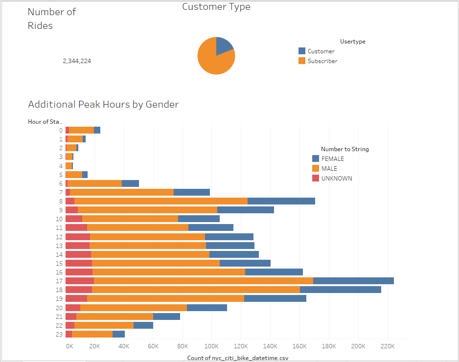
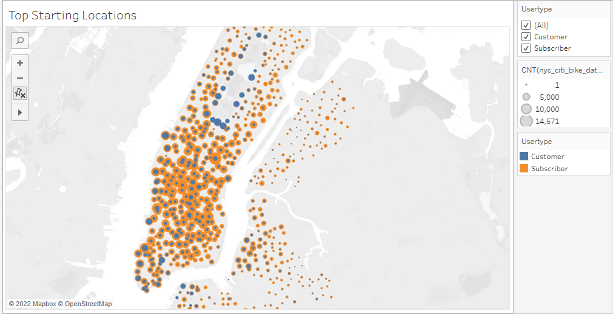
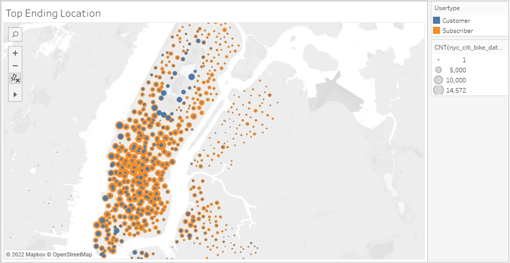

# NYC CitiBike

## Project Overview
### Purpose

For this project we are creating data visualization with Tableau for bike sharing program in New York City. The idea is to analyze the data, observe the mechanics of the business and figure out how the bike share business works in NYC. This is the first step of expanding the idea to other cities. With the help of strong and clear story and good example of data we can create a proposal on how the business could work in other cities as well.

**The Tableau story of the NYC CitiBike can be found in the following link:** [NYC CitiBike Story](https://public.tableau.com/app/profile/sneha.joshi2904/viz/HomeworkNyc_Bike_Sharing/NYCCitiBikeStory?publish=yes/)

### Background 

- Tableau is a data visualization tool which provides pictorial and graphical representations of data. 
- It allows to create stories that are visually appealing and understandable to any non-technical user.
- It provides the tool which creates powerful analytic dashboards and tells clear story which can be easily shared to others.
- It is simple, required little coding or write queries as 'Calculated Field’, to ensure your data is showing correct analytics as per the requirements. 

## Requirements

-  Change Trip Duration to a Datetime Format
  - Pandas to convert integer to a datetime datatype.
  
-  Create Visualizations for the Trip Analysis
    - Tableau to create visualizations, dashboard, and story.

## Resources 
-	Data Source:
    - [CitiBike Trip History Data from August 2019 in NYC](https://www.citibikenyc.com/system-data)
    
-	Software:
    - Tableau Public 2021.4
   
-	Languages & Environment:
    - Pandas, Python 3.7

## Results

### Basic Information

This is the first page of the story which is dashboard, and it contains basic information about the data set.
It gives details of the dataset to understand what kind of data we will be dealing with in the further analysis. 
  

The page contains the following information:
-	Type of business (CitiBike), location with particular time frame of the data (New York City, August 2019).
-	Number of the total rides: 2,344,224.
-	Customer type: subscribers and customers.
-	Peak hours, divided by gender which shows the user behavior.
#
### 1. Checkout Times for Users

 
- This visualization shows the length of time of every bike ride during the month of August in 2019. 
- It shows that riders typically like to ride bike between 2 and 15 minutes.

#
### 2. Check Out Time by Gender

- The graph shows number of checkout bikes and trip duration.
- Three different colors represent the classification of gender. Yellow represents male, blue represents female and red represents the unknown gender. 
- This visualization shows the breakdown of riders by gender and duration of times showing that most of the users are men.
 
#
### 3. Trips by Weekday per Hour

- The graph shows number of trips per hour and per weekday. 
- The graph has hours as rows and weekdays as columns.
- The color indicates the number of trips.
  - Darker shade color indicates more trips,
  - Lighter shade color indicates less trips.
-  Form the graph we can see that the busiest times are in the morning hours on weekdays from 6 am and 9 am and evening hours on weekdays between 5 pm and 7 pm. 
-  On weekends (Saturday and Sunday) the busiest times are in the middle of the day between 10 am and 6 pm.

#
### 4. Trips by Gender (Weekday per Hour)

- The graph shows number of trips per hour and per weekday. 
- The graph has hours on the rows and weekdays on the columns.
-  The color indicates the number of the trips.
   - Darker shade color indicates more trips,
   - Lighter shade color indicates less trips.
-  Additionally, the graph is divided by gender (male, female and unknown). 
-  From the graph we can see that distribution of the checkout times for all genders is similar.
  - The busiest times are
     - In the morning hours on weekdays from 6 am and 9 am
     - In the evening hours on weekdays between 5 pm and 7 pm. 
     - On weekends (Saturday and Sunday) the busiest times are in the middle of the day between 10 am and 6 pm. 
-  However, males have significant higher number of trips than female or unknown gender. 

#
### 5. User Trips by Gender by Weekday

- The graph shows number of trips by weekday, by user type (subscribers and customers) and by gender. 
- The graph has weekdays and user type as rows and gender as columns.
- Amongst subscribers, male has the highest number of the trips especially on Thursdays and Fridays, followed by trips on Monday and Tuesdays.
- Female has similar distribution of trips, with significant lower number of trips than male.
- Unknown gender has uniform distribution of the trips throughout the week. 
- Looking at the customers’ data we can see significant less trips throughout all genders with slight increase amongst unknown gender on Saturdays and Sundays.

#
### 6. Top Starting Locations & Top Ending Locations

    

- With the help of these two graphs we can see the most popular starting and ending locations.
- The color indicates the types of users
  - Orange color represent subscribers,
  - Blue represent customers.
-  The bubble shapes represent the number of trips. 
  - Larger bubbles represent locations with the highest number of trips, 
  - Smaller bubbles represent lowest number of trips.
-  Also, we can find out popularity of stations amongst subscribers vs. customers and what areas are more popular than others.
-  Downtown area is much more popular than other areas, yet it is as important for surrounding areas to have bike services for good customer experience.

## Summary

In the NYC CitiBike story, it tells us more about number of users and how they use the bikes per hour, by weekday per hour, who is most popular user type, popular areas,
peak hours by gender. 

There are some points we should investigate:

**1.Bike maintenance**

- Bike maintenance plays a big role in bike share business.
- Heat maps tell us clear story about the data which will helps us to visualize the scenario. 
- From the graphs *Peak Hours per Gender*, *Trips by Weekday per Hour* and *Trips by Gender(Weekday per Hour)* we can see that the least busy time is between 11pm and 5am. That suggests a good time for bike maintenance.
- With the help of this we can make a plan for maintenance and rotation of the bikes from popular station to less popular stations as we can see in the graph *Top Starting Stations* and *Top Ending Stations*. 

**2.Trip-duration**

- The most popular trip duration checkout time is between 3-8 hours. From this we can learn more about users behavior.
- There should be some flexibility on usage of bikes per mile. 

#
 
The NYC CitiBike story says lot about users and trips which will definitely helpful for us to create Citi bike program in De Moines. 

We should concentrate on some areas to make Citibike more popular and efficient for users.  

- Marketing and Advertising will play crucial role in making Citibike more popular among the crowd. 
- Bike stands must be easily accessible to the users.
- Bike stands should be positioned in the most crowded (as per the population) areas.
- Offering some good plans according to seasons and festivals So that people will use bikes more often.
- Also considering kids as type for some areas in the city itself will increase the chance of popularity among the crowd.

